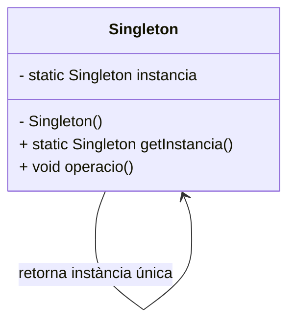

# Patró Singleton

## 1. Categoria
**Patró Creacional**

---

## 2. Propòsit
El patró **Singleton** garanteix que una classe tingui **una única instància** durant tota l'execució del programa, i proporciona un punt d'accés global a aquesta instància.

---

## 3. Quan utilitzar-lo
- Quan necessitem exactament **un objecte** per coordinar accions a tot el sistema.
- Exemples reals: gestor de configuració, connexió a base de dades, sistema de logs, caché.

---

## 4. Diagrama UML



---

## 5. Estructura
| Element | Descripció |
|---|---|
| Constructor privat | Impedeix la creació d'instàncies des de fora |
| Atribut estàtic privat | Guarda l'única instància de la classe |
| Mètode estàtic públic | Retorna la instància (la crea si no existeix) |

---

## 6. Exemple Java complet

```java
/**
 * Exemple Singleton: GestorDeLog
 * Registra missatges a tot el sistema des d'un únic punt.
 */
public class GestorDeLog {

    // 1. Atribut estàtic privat que guarda l'única instància
    private static GestorDeLog instancia;

    // 2. Constructor privat: impedeix instanciació externa
    private GestorDeLog() {
        System.out.println("GestorDeLog inicialitzat.");
    }

    // 3. Mètode públic i estàtic per obtenir la instància
    public static GestorDeLog getInstancia() {
        if (instancia == null) {
            instancia = new GestorDeLog();
        }
        return instancia;
    }

    // Mètode d'exemple
    public void log(String missatge) {
        System.out.println("[LOG] " + missatge);
    }
}
```

```java
// Classe principal per provar el Singleton
public class Main {
    public static void main(String[] args) {

        // Obtenim la instància des de llocs diferents
        GestorDeLog log1 = GestorDeLog.getInstancia();
        GestorDeLog log2 = GestorDeLog.getInstancia();

        log1.log("Aplicació iniciada.");
        log2.log("Usuari connectat.");

        // Comprovem que és la mateixa instància
        System.out.println("Mateixa instància? " + (log1 == log2)); // true
    }
}
```

**Sortida esperada:**
```
GestorDeLog inicialitzat.
[LOG] Aplicació iniciada.
[LOG] Usuari connectat.
Mateixa instància? true
```

---

## 7. Thread Safety (per saber-ne més)

La versió anterior és correcta per a aplicacions **monofil**, que és el cas habitual al mòdul. Si en un futur treballeu amb múltiples fils (MP08), caldrà afegir `synchronized`:

```java
// Només necessari en entorns multifil:
public static synchronized GestorDeLog getInstancia() {
    if (instancia == null) {
        instancia = new GestorDeLog();
    }
    return instancia;
}
```

> ℹ️ `synchronized` garanteix que només un fil alhora pot executar el mètode. No cal als exercicis d'aquest mòdul.

---

## 8. Avantatges i inconvenients

| ✅ Avantatges | ❌ Inconvenients |
|---|---|
| Controla l'accés a la instància única | Dificulta les proves unitàries (testing) |
| Estalvia memòria | Pot ser problemàtic en entorns multithread si no es gestiona bé |
| Punt d'accés global senzill | Viola el principi de responsabilitat única si s'abusa |

---

## 8. Relació amb altres patrons
- **Factory Method** pot retornar sempre la mateixa instància, comportant-se com un Singleton.
- **Facade** sovint s'implementa com a Singleton.

---

> 📘 **Mòdul 0485 · BA4 Patrons** · 1r CFGS DAM
