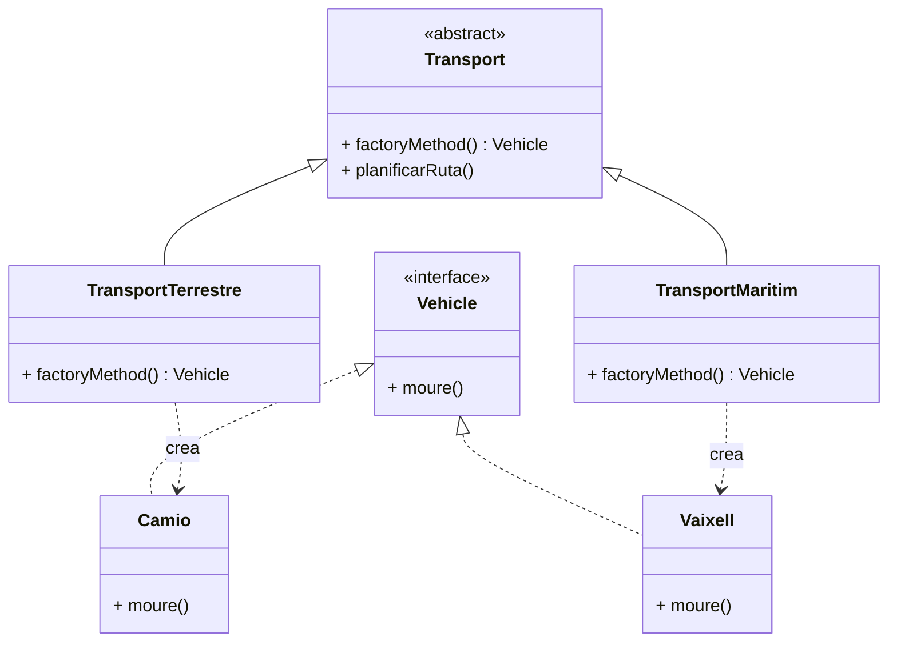

# Patró Factory Method

## 1. Categoria
**Patró Creacional**

---

## 2. Propòsit
El patró **Factory Method** defineix un mètode abstracte a una classe pare per crear objectes, però **delega a les subclasses** la decisió de quina classe concreta instanciar.

> Diferència clau amb el Simple Factory: en comptes d'un mètode estàtic amb `switch`, cada subclasse sobreescriu el `factoryMethod()` i decideix ella mateixa quin objecte crear.

---

## 3. Quan utilitzar-lo
- Quan volem que les subclasses decideixin quin tipus d'objecte crear.
- Quan afegir nous tipus no ha de requerir modificar el codi existent (principi Obert/Tancat).
- Exemples reals: frameworks de jocs, parsers de fitxers, connectors a bases de dades.

---

## 4. Diagrama UML



---

## 5. Estructura

| Element | Descripció |
|---|---|
| `Vehicle` (interfície) | Defineix el contracte dels objectes a crear |
| `Camio`, `Vaixell` | Implementacions concretes del producte |
| `Transport` (abstract) | Declara el `factoryMethod()` i el mètode que l'usa |
| `TransportTerrestre`, `TransportMaritim` | Sobreescriuen `factoryMethod()` retornant el seu producte concret |

---

## 6. Exemple Java complet

```java
// 1. Interfície producte
public interface Vehicle {
    void moure();
}
```

```java
// 2. Productes concrets
public class Camio implements Vehicle {
    @Override
    public void moure() {
        System.out.println("El camió circula per carretera.");
    }
}

public class Vaixell implements Vehicle {
    @Override
    public void moure() {
        System.out.println("El vaixell navega per mar.");
    }
}
```

```java
// 3. Creator abstracte
public abstract class Transport {

    // El Factory Method: abstracte, cada subclasse el sobreescriu
    public abstract Vehicle factoryMethod();

    // Usa el producte sense saber quin és concretament
    public void planificarRuta() {
        Vehicle v = factoryMethod();
        v.moure();
    }
}
```

```java
// 4. Creators concrets: cada subclasse decideix quin Vehicle crea
public class TransportTerrestre extends Transport {
    @Override
    public Vehicle factoryMethod() {
        return new Camio();
    }
}

public class TransportMaritim extends Transport {
    @Override
    public Vehicle factoryMethod() {
        return new Vaixell();
    }
}
```

```java
// 5. Main: el client treballa amb Transport, mai amb Camio o Vaixell directament
public class Main {
    public static void main(String[] args) {

        Transport t1 = new TransportTerrestre();
        t1.planificarRuta();

        Transport t2 = new TransportMaritim();
        t2.planificarRuta();
    }
}
```

**Sortida esperada:**
```
El camió circula per carretera.
El vaixell navega per mar.
```

---

## 7. El punt clau: qui decideix?

A `planificarRuta()` hi ha aquesta línia:
```java
Vehicle v = factoryMethod();
```
`Transport` no sap quin `Vehicle` crearà — ho decideix la subclasse en temps d'execució. El mètode `planificarRuta()` funciona igual independentment de si és un `TransportTerrestre` o un `TransportMaritim`.

---

## 8. Simple Factory vs Factory Method

| | Simple Factory | Factory Method |
|---|---|---|
| **Crea via** | Mètode estàtic amb `switch` | Subclasses que sobreescriuen |
| **Afegir nou tipus** | Modificar el `switch` ❌ | Crear nova subclasse ✅ |
| **Principi OCP** | No respecta | Sí respecta |
| **Complexitat** | Baixa | Mitjana |

Per afegir `TransportAeri`: crear `Avio implements Vehicle` i `TransportAeri extends Transport`. **Cap classe existent es modifica.**

---

## 9. Avantatges i inconvenients

| ✅ Avantatges | ❌ Inconvenients |
|---|---|
| Afegir nous tipus sense tocar codi existent (OCP) | Augmenta el nombre de classes |
| El client treballa sempre amb abstraccions | Pot ser excessiu per a casos simples |
| Cada subclasse té una responsabilitat clara | Cal entendre bé l'herència |

---

> 📘 **Mòdul 0485 · BA4 Patrons** · 1r CFGS DAM
