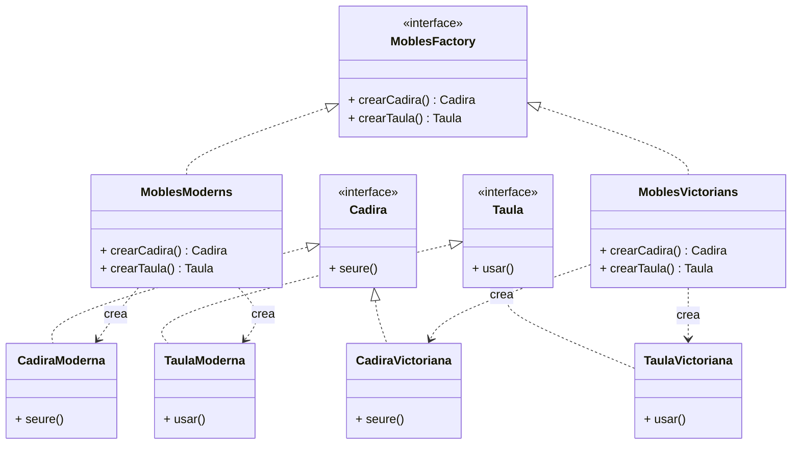

# Patró Abstract Factory

## 1. Categoria
**Patró Creacional**

---

## 2. Propòsit
El patró **Abstract Factory** proporciona una interfície per crear **famílies d'objectes relacionats** sense especificar les seves classes concretes.

> Diferència clau amb el Factory Method: el Factory Method crea **un tipus** d'objecte; l'Abstract Factory crea **una família** d'objectes que han de ser consistents entre ells.

---

## 3. Quan utilitzar-lo
- Quan el sistema ha de treballar amb famílies de productes que han d'anar aparellats.
- Quan vols canviar tota una família d'objectes amb un sol canvi.
- Exemples reals: kits d'interfície gràfica multiplataforma, temes visuals, connectors a bases de dades.

---

## 4. Diagrama UML



---

## 5. Estructura

| Element | Descripció |
|---|---|
| `MoblesFactory` (interfície) | Declara un mètode de creació per a cada producte de la família |
| `MoblesModerns`, `MoblesVictorians` | Implementen la creació d'una família concreta |
| `Cadira`, `Taula` (interfícies) | Contracte per a cada tipus de producte |
| `CadiraModerna`, `TaulaVictoriana`... | Implementacions concretes de cada producte |
| Client | Usa només les interfícies abstractes, mai les classes concretes |

---

## 6. Exemple Java complet

```java
// 1. Productes abstractes
public interface Cadira {
    void seure();
}

public interface Taula {
    void usar();
}
```

```java
// 2. Família Moderna
public class CadiraModerna implements Cadira {
    @Override
    public void seure() {
        System.out.println("Seient en una cadira moderna minimalista.");
    }
}

public class TaulaModerna implements Taula {
    @Override
    public void usar() {
        System.out.println("Usant una taula moderna de vidre.");
    }
}
```

```java
// 3. Família Victoriana
public class CadiraVictoriana implements Cadira {
    @Override
    public void seure() {
        System.out.println("Seient en una cadira victoriana amb coixí de vellut.");
    }
}

public class TaulaVictoriana implements Taula {
    @Override
    public void usar() {
        System.out.println("Usant una taula victoriana de fusta tallada.");
    }
}
```

```java
// 4. Abstract Factory
public interface MoblesFactory {
    Cadira crearCadira();
    Taula  crearTaula();
}
```

```java
// 5. Factories concretes
public class MoblesModerns implements MoblesFactory {
    @Override
    public Cadira crearCadira() { return new CadiraModerna();    }
    @Override
    public Taula  crearTaula()  { return new TaulaModerna();     }
}

public class MoblesVictorians implements MoblesFactory {
    @Override
    public Cadira crearCadira() { return new CadiraVictoriana(); }
    @Override
    public Taula  crearTaula()  { return new TaulaVictoriana();  }
}
```

```java
// 6. Client: rep la factory per paràmetre, no coneix les classes concretes
public class Habitacio {
    private Cadira cadira;
    private Taula  taula;

    public Habitacio(MoblesFactory factory) {
        this.cadira = factory.crearCadira();
        this.taula  = factory.crearTaula();
    }

    public void descriure() {
        cadira.seure();
        taula.usar();
    }
}
```

```java
// 7. Main
public class Main {
    public static void main(String[] args) {

        // Canviar una línia canvia tota la família
        MoblesFactory factory = new MoblesModerns();
        // MoblesFactory factory = new MoblesVictorians();

        Habitacio hab = new Habitacio(factory);
        hab.descriure();
    }
}
```

**Sortida amb `MoblesModerns`:**
```
Seient en una cadira moderna minimalista.
Usant una taula moderna de vidre.
```

**Sortida amb `MoblesVictorians`:**
```
Seient en una cadira victoriana amb coixí de vellut.
Usant una taula victoriana de fusta tallada.
```

---

## 7. El punt clau: coherència de família

| Factory | Cadira | Taula |
|---|---|---|
| `MoblesModerns` | `CadiraModerna` | `TaulaModerna` |
| `MoblesVictorians` | `CadiraVictoriana` | `TaulaVictoriana` |

Amb l'Abstract Factory és **impossible** combinar una `CadiraModerna` amb una `TaulaVictoriana` accidentalment — cada factory garanteix que els seus productes van sempre aparellats.

---

## 8. Factory Method vs Abstract Factory

| | Factory Method | Abstract Factory |
|---|---|---|
| **Crea** | Un producte | Una família de productes |
| **Via** | Herència (subclasses) | Composició (injecció de factory) |
| **Ús típic** | Un objecte variable | Grups d'objectes coherents |
| **Complexitat** | Menor | Major |

---

## 9. Avantatges i inconvenients

| ✅ Avantatges | ❌ Inconvenients |
|---|---|
| Garanteix coherència entre productes d'una família | Afegir un nou producte implica modificar totes les factories |
| Canvi de família sencer amb un sol canvi | Genera moltes classes i interfícies |
| El client desacoblat de les classes concretes | Més complex d'entendre que el Factory Method |

---

> 📘 **Mòdul 0485 · BA4 Patrons** · 1r CFGS DAM
