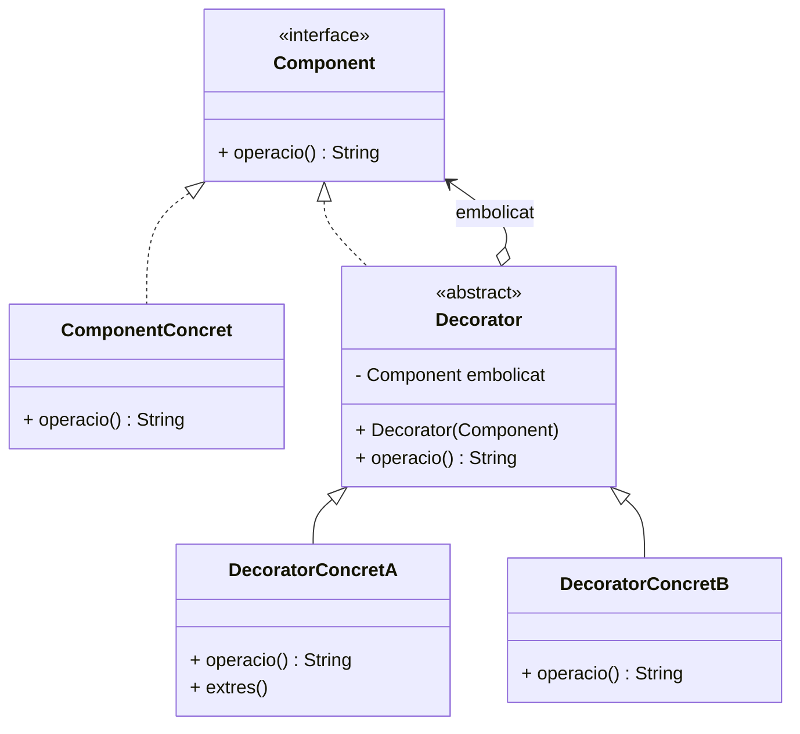

# Patró Decorator

## 1. Categoria
**Patró Estructural**

---

## 2. Propòsit
El patró **Decorator** afegeix responsabilitats noves a un objecte de forma **dinàmica**, sense modificar la seva classe. És una alternativa flexible a la herència per estendre funcionalitats.

---

## 3. Quan utilitzar-lo
- Quan volem afegir comportament a objectes individuals sense afectar els altres.
- Quan l'herència no és viable perquè generaria una explosió de subclasses.
- Exemples reals: fluxos d'entrada/sortida de Java (`InputStream`, `BufferedReader`), middleware en servidors web, elements d'interfície gràfica.

---

## 4. Diagrama UML



---

## 5. Estructura
| Element | Descripció |
|---|---|
| `Component` (interfície) | Defineix el contracte comú |
| `ComponentConcret` | Objecte base que decorarem |
| `Decorator` (abstract) | Manté referència al `Component` i delega crides |
| `DecoratorConcret` | Afegeix comportament addicional |

---

## 6. Exemple Java complet

Volem preparar cafès amb diferents complements (llet, sucre, xocolata) sense crear una subclasse per a cada combinació.

```java
// 1. Interfície Component
public interface Cafè {
    String getDescripcio();
    double getPreu();
}
```

```java
// 2. Component Concret: Cafè base
public class CafèSimple implements Cafè {
    @Override
    public String getDescripcio() {
        return "Cafè sol";
    }

    @Override
    public double getPreu() {
        return 1.00;
    }
}
```

```java
// 3. Decorator abstracte
public abstract class CafèDecorator implements Cafè {
    protected Cafè cafèEmbolicat;

    public CafèDecorator(Cafè cafè) {
        this.cafèEmbolicat = cafè;
    }

    @Override
    public String getDescripcio() {
        return cafèEmbolicat.getDescripcio();
    }

    @Override
    public double getPreu() {
        return cafèEmbolicat.getPreu();
    }
}
```

```java
// 4. Decoradors concrets
public class AmbLlet extends CafèDecorator {
    public AmbLlet(Cafè cafè) {
        super(cafè);
    }

    @Override
    public String getDescripcio() {
        return cafèEmbolicat.getDescripcio() + ", Llet";
    }

    @Override
    public double getPreu() {
        return cafèEmbolicat.getPreu() + 0.30;
    }
}

public class AmbSucre extends CafèDecorator {
    public AmbSucre(Cafè cafè) {
        super(cafè);
    }

    @Override
    public String getDescripcio() {
        return cafèEmbolicat.getDescripcio() + ", Sucre";
    }

    @Override
    public double getPreu() {
        return cafèEmbolicat.getPreu() + 0.10;
    }
}

public class AmbXocolata extends CafèDecorator {
    public AmbXocolata(Cafè cafè) {
        super(cafè);
    }

    @Override
    public String getDescripcio() {
        return cafèEmbolicat.getDescripcio() + ", Xocolata";
    }

    @Override
    public double getPreu() {
        return cafèEmbolicat.getPreu() + 0.50;
    }
}
```

```java
// 5. Classe principal
public class Main {
    public static void main(String[] args) {

        // Cafè simple
        Cafè cafè = new CafèSimple();
        System.out.println(cafè.getDescripcio() + " → " + cafè.getPreu() + "€");

        // Cafè amb llet i sucre
        Cafè cafèLletSucre = new AmbSucre(new AmbLlet(new CafèSimple()));
        System.out.println(cafèLletSucre.getDescripcio() + " → " + cafèLletSucre.getPreu() + "€");

        // Cafè amb xocolata i dos sucres
        Cafè cafèEspecial = new AmbSucre(new AmbSucre(new AmbXocolata(new CafèSimple())));
        System.out.println(cafèEspecial.getDescripcio() + " → " + cafèEspecial.getPreu() + "€");
    }
}
```

**Sortida esperada:**
```
Cafè sol → 1.0€
Cafè sol, Llet, Sucre → 1.4€
Cafè sol, Xocolata, Sucre, Sucre → 1.7€
```

---

## 7. Avantatges i inconvenients

| ✅ Avantatges | ❌ Inconvenients |
|---|---|
| Evita l'explosió de subclasses | Pot generar moltes classes petites |
| Es poden combinar decoradors lliurement | L'ordre dels decoradors és important |
| Segueix el principi Obert/Tancat (OCP) | Pot ser difícil de depurar amb moltes capes |

---

## 8. Connexió amb Java estàndard
Java fa servir aquest patró extensivament en els seus fluxos d'E/S:
```java
BufferedReader br = new BufferedReader(
                        new InputStreamReader(
                            new FileInputStream("fitxer.txt")));
```
Cada classe "embolica" l'anterior afegint funcionalitat nova.

---

> 📘 **Mòdul 0485 · BA4 Patrons** · 1r CFGS DAM
