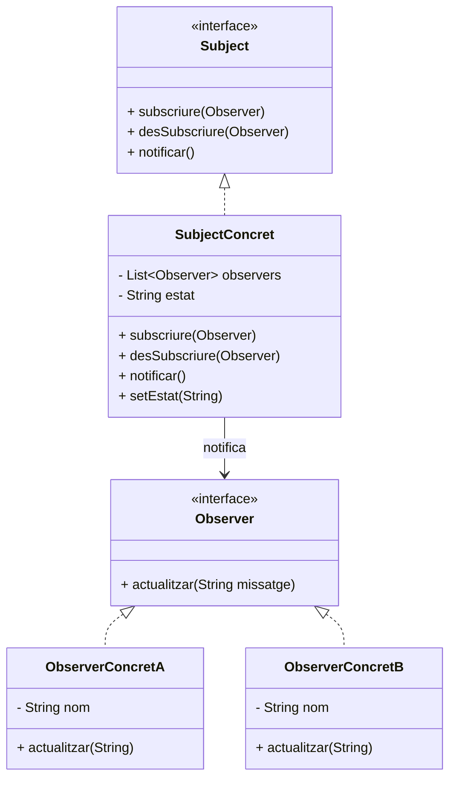

# Patró Observer

## 1. Categoria
**Patró de Comportament**

---

## 2. Propòsit
El patró **Observer** defineix una dependència d'un a molts entre objectes: quan un objecte (**Subject**) canvia d'estat, tots els seus **Observers** (subscriptors) són notificats i actualitzats automàticament.

---

## 3. Quan utilitzar-lo
- Quan un canvi en un objecte requereix actualitzar altres objectes i no saps quants hi ha.
- Quan vols un acoblament baix entre el subjecte i els observadors.
- Exemples reals: sistemes d'esdeveniments (listeners), notificacions push, actualitzacions de la UI (MVC/MVP), feeds de xarxes socials.

---

## 4. Diagrama UML



---

## 5. Estructura
| Element | Descripció |
|---|---|
| `Subject` (interfície) | Gestiona la llista d'observadors |
| `SubjectConcret` | Manté l'estat i notifica als observadors en canviar |
| `Observer` (interfície) | Defineix el mètode `actualitzar()` |
| `ObserverConcret` | Rep i processa les notificacions |

---

## 6. Exemple Java complet

Simulem una **borsa de valors**: quan el preu d'una acció canvia, els inversors (observadors) són notificats.

```java
// 1. Interfície Observer
public interface Inversor {
    void actualitzar(String accio, double nouPreu);
}
```

```java
// 2. Interfície Subject
import java.util.List;

public interface MercatBorsari {
    void subscriure(Inversor inversor);
    void desSubscriure(Inversor inversor);
    void notificar();
}
```

```java
// 3. Subject Concret
import java.util.ArrayList;
import java.util.List;

public class Accio implements MercatBorsari {

    private String nomAccio;
    private double preu;
    private List<Inversor> inversors = new ArrayList<>();

    public Accio(String nom, double preuInicial) {
        this.nomAccio = nom;
        this.preu = preuInicial;
    }

    @Override
    public void subscriure(Inversor inversor) {
        inversors.add(inversor);
    }

    @Override
    public void desSubscriure(Inversor inversor) {
        inversors.remove(inversor);
    }

    @Override
    public void notificar() {
        for (Inversor inv : inversors) {
            inv.actualitzar(nomAccio, preu);
        }
    }

    // Quan el preu canvia, es notifica automàticament
    public void setPreu(double nouPreu) {
        System.out.println("\n[BORSA] " + nomAccio + " canvia de " + preu + "€ a " + nouPreu + "€");
        this.preu = nouPreu;
        notificar();
    }
}
```

```java
// 4. Observers concrets
public class InversorPrivat implements Inversor {
    private String nom;

    public InversorPrivat(String nom) {
        this.nom = nom;
    }

    @Override
    public void actualitzar(String accio, double nouPreu) {
        System.out.println("  [Inversor " + nom + "] Alerta! " + accio + " ara val " + nouPreu + "€");
    }
}

public class RobotTrading implements Inversor {
    @Override
    public void actualitzar(String accio, double nouPreu) {
        if (nouPreu < 100) {
            System.out.println("  [Robot Trading] Comprant " + accio + " a " + nouPreu + "€ → OPORTUNITAT!");
        } else {
            System.out.println("  [Robot Trading] Preu de " + accio + " massa alt (" + nouPreu + "€). Esperant...");
        }
    }
}
```

```java
// 5. Classe principal
public class Main {
    public static void main(String[] args) {

        // Creem l'acció
        Accio apple = new Accio("AAPL", 150.00);

        // Creem observadors
        Inversor anna  = new InversorPrivat("Anna");
        Inversor jordi = new InversorPrivat("Jordi");
        Inversor robot = new RobotTrading();

        // Subscripció
        apple.subscriure(anna);
        apple.subscriure(jordi);
        apple.subscriure(robot);

        // Simulem canvis de preu
        apple.setPreu(145.00);
        apple.setPreu(95.00);

        // Jordi es dessubscriu
        System.out.println("\n[INFO] Jordi es dessubscriu.");
        apple.desSubscriure(jordi);

        apple.setPreu(200.00);
    }
}
```

**Sortida esperada:**
```
[BORSA] AAPL canvia de 150.0€ a 145.0€
  [Inversor Anna] Alerta! AAPL ara val 145.0€
  [Inversor Jordi] Alerta! AAPL ara val 145.0€
  [Robot Trading] Preu de AAPL massa alt (145.0€). Esperant...

[BORSA] AAPL canvia de 145.0€ a 95.0€
  [Inversor Anna] Alerta! AAPL ara val 95.0€
  [Inversor Jordi] Alerta! AAPL ara val 95.0€
  [Robot Trading] Comprant AAPL a 95.0€ → OPORTUNITAT!

[INFO] Jordi es dessubscriu.

[BORSA] AAPL canvia de 95.0€ a 200.0€
  [Inversor Anna] Alerta! AAPL ara val 200.0€
  [Robot Trading] Preu de AAPL massa alt (200.0€). Esperant...
```

---

## 7. Avantatges i inconvenients

| ✅ Avantatges | ❌ Inconvenients |
|---|---|
| Baix acoblament entre Subject i Observer | Notificacions inesperades si no es gestionen bé |
| Fàcil afegir nous observadors sense modificar el Subject | Ordre de notificació no garantit |
| Principi Obert/Tancat (OCP) | Possible consum de memòria si no es dessubscriu |

---

## 8. Observer a Java estàndard
Java proporciona `java.util.Observer` (deprecated des de Java 9) i el patró s'utilitza àmpliament en:
- **Swing/AWT**: `ActionListener`, `MouseListener`
- **JavaFX**: propietats observables (`ObservableList`)
- **Spring**: `ApplicationEvent` / `@EventListener`

---

> 📘 **Mòdul 0485 · BA4 Patrons** · 1r CFGS DAM
