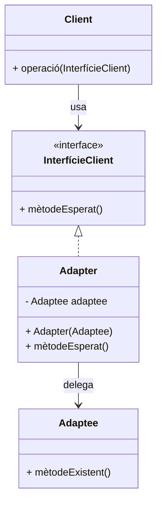

# Patró Adapter

## 1. Categoria
**Patró Estructural**

---

## 2. Propòsit
El patró **Adapter** permet que dues interfícies **incompatibles** puguin treballar juntes. Actua com a intermediari que tradueix les crides d'una interfície a l'altra, sense modificar el codi existent.

> Analogia: com un **adaptador de corrent** de viatge que permet connectar un endoll americà a una presa europea.

---

## 3. Quan utilitzar-lo
- Quan vols reutilitzar una classe existent però la seva interfície no és compatible amb la resta del sistema.
- Quan integres biblioteques de tercers o codi llegat.
- Exemples reals: adaptadors de bases de dades (JDBC), connectors d'APIs externes, conversió de formats de dades.

---

## 4. Diagrama UML



---

## 5. Estructura
| Element | Descripció |
|---|---|
| `InterfícieClient` | El que espera el nostre sistema (interfície objectiu) |
| `Adaptee` | La classe existent amb una interfície diferent |
| `Adapter` | Embolica l'`Adaptee` i implementa la `InterfícieClient` |
| `Client` | Usa la `InterfícieClient` sense saber res de l'`Adaptee` |

---

## 6. Exemple Java complet

Tenim un sistema que treballa amb `Forma` (interfície pròpia), però volem integrar una biblioteca externa `FormaLlegat` que ja existeix i no podem modificar.

```java
// 1. Interfície que espera el nostre sistema
public interface Forma {
    void dibuixar();
    String getDescripcio();
}
```

```java
// 2. Clase pròpia compatible
public class Cercle implements Forma {
    private double radi;

    public Cercle(double radi) {
        this.radi = radi;
    }

    @Override
    public void dibuixar() {
        System.out.println("Dibuixant cercle de radi " + radi);
    }

    @Override
    public String getDescripcio() {
        return "Cercle (radi=" + radi + ")";
    }
}
```

```java
// 3. Classe LLEGAT (biblioteca externa) — NO la podem modificar
public class RectangleLlegat {
    private int x, y, amplada, alçada;

    public RectangleLlegat(int x, int y, int amplada, int alçada) {
        this.x = x;
        this.y = y;
        this.amplada = amplada;
        this.alçada = alçada;
    }

    // Mètodes amb noms diferents als de la nostra interfície
    public void render() {
        System.out.println("Renderitzant rectangle a (" + x + "," + y + ") " 
                           + amplada + "x" + alçada);
    }

    public String info() {
        return "RectangleLlegat[" + amplada + "x" + alçada + "]";
    }
}
```

```java
// 4. L'ADAPTER: fa que RectangleLlegat funcioni com a Forma
public class RectangleAdapter implements Forma {

    // Conté (embolica) la classe llegat
    private RectangleLlegat rectangleLlegat;

    public RectangleAdapter(RectangleLlegat rectangleLlegat) {
        this.rectangleLlegat = rectangleLlegat;
    }

    // Tradueix dibuixar() → render()
    @Override
    public void dibuixar() {
        rectangleLlegat.render();   // delegació traduïda
    }

    // Tradueix getDescripcio() → info()
    @Override
    public String getDescripcio() {
        return rectangleLlegat.info();  // delegació traduïda
    }
}
```

```java
// 5. Classe principal
import java.util.ArrayList;
import java.util.List;

public class Main {
    public static void main(String[] args) {

        // Llista de Formes (el client només coneix Forma)
        List<Forma> formes = new ArrayList<>();

        // Objecte natiu
        formes.add(new Cercle(5.0));

        // Objecte llegat adaptat → el client no nota la diferència!
        RectangleLlegat rl = new RectangleLlegat(10, 20, 100, 50);
        formes.add(new RectangleAdapter(rl));

        // El client treballa de forma uniforme
        System.out.println("=== Dibuixant totes les formes ===");
        for (Forma f : formes) {
            System.out.println("· " + f.getDescripcio());
            f.dibuixar();
            System.out.println();
        }
    }
}
```

**Sortida esperada:**
```
=== Dibuixant totes les formes ===
· Cercle (radi=5.0)
Dibuixant cercle de radi 5.0

· RectangleLlegat[100x50]
Renderitzant rectangle a (10,20) 100x50
```

---

## 7. Tipus d'Adapter

### Adapter per composició (Object Adapter) ← l'exemple anterior
L'Adapter **conté** l'Adaptee com a atribut. És el més habitual a Java.

### Adapter per herència (Class Adapter)
L'Adapter **hereta** de l'Adaptee. Requereix herència múltiple (no disponible directament a Java, però sí amb interfícies).

---

## 8. Avantatges i inconvenients

| ✅ Avantatges | ❌ Inconvenients |
|---|---|
| Reutilitza codi llegat sense modificar-lo | Augmenta la complexitat del codi |
| Integra biblioteques externes fàcilment | Pot haver-hi pèrdua de rendiment per la capa extra |
| Segueix el principi Obert/Tancat (OCP) | Si hi ha molts mètodes a adaptar, l'Adapter es fa gran |

---

## 9. Adapter a Java estàndard
- `Arrays.asList()` adapta un array a `List`.
- `InputStreamReader` adapta `InputStream` (bytes) a `Reader` (caràcters).
- `Collections.enumeration()` adapta una `Collection` a `Enumeration`.

---

> 📘 **Mòdul 0485 · BA4 Patrons** · 1r CFGS DAM
